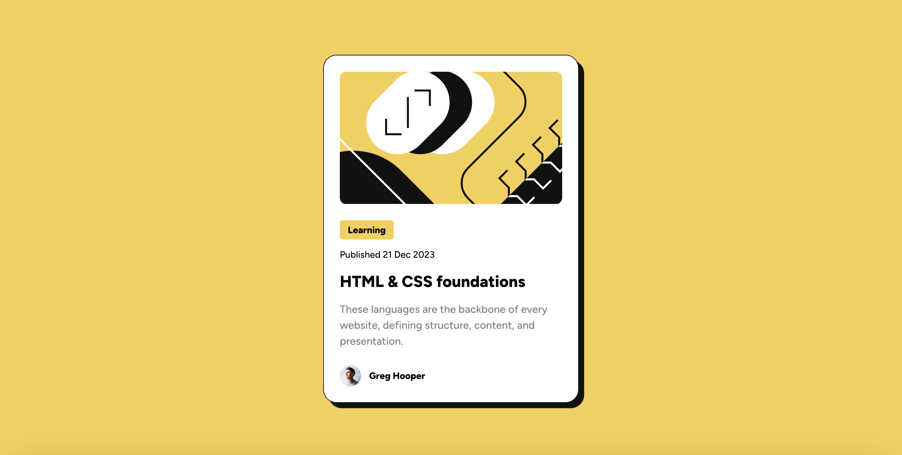

# Frontend Mentor - Blog preview card solution

This is a solution to the [Blog preview card challenge on Frontend Mentor](https://www.frontendmentor.io/challenges/blog-preview-card-ckPaj01IcS). Frontend Mentor challenges help you improve your coding skills by building realistic projects. 

## Table of contents

- [Overview](#overview)
  - [The challenge](#the-challenge)
  - [Screenshot](#screenshot)
  - [Links](#links)
- [My process](#my-process)
  - [Built with](#built-with)
  - [What I learned](#what-i-learned)
  - [Continued development](#continued-development)
  - [Useful resources](#useful-resources)
- [Author](#author)

## Overview

### The challenge

Users should be able to:

- See hover and focus states for all interactive elements on the page

### Screenshot



### Links

- Solution URL: [https://www.frontendmentor.io/solutions/blog-preview-card-using-flexbox-bem-jnrQoLZrrv]
- Live Site URL: [https://hchao7.github.io/blog-preview-card/]

## My process

### Built with

- Semantic HTML5 markup
- BEM Methodology
- Flexbox

### What I learned

I learned how to make websites responsive without using media queries. For example, I used `clamp()` to resize the font-size and width based on the viewport. This method ensures that both properties shrink to the mobile sizes and expand to the desktop sizes specified by the design file.

I gained more experience using Flexbox. To write cleaner CSS, I used Flexbox to distribute space between and within elements, rather than relying on margins or padding. For example, the child elements inside `.card_content` are spaced apart using the `gap` property.

```css
.card__content {
  display: flex;
  flex-direction: column;
  gap: 12px;
  min-width: 100%;
  height: auto;
}
```

### Continued development

This project specified reducing font-size for smaller screens without using media queries. I used `clamp()`, which resizes the font-size gradually. Next time, I’d like to use media queries so there is an instant transition from the desktop font-size to mobile font-size once the viewport reaches a certain width. 

### Useful resources

- [A Complete Guide to Flexbox](https://css-tricks.com/snippets/css/a-guide-to-flexbox/#aa-background) - This helped me understand the Flexbox `gap` property.
- [`clamp()`](https://developer.mozilla.org/en-US/docs/Web/CSS/clamp)
- [Custom CSS Reset](https://www.joshwcomeau.com/css/custom-css-reset/) - This helped me reset the browser default styles.

## Author

- Frontend Mentor - [@hchao7](https://www.frontendmentor.io/profile/hchao7)

